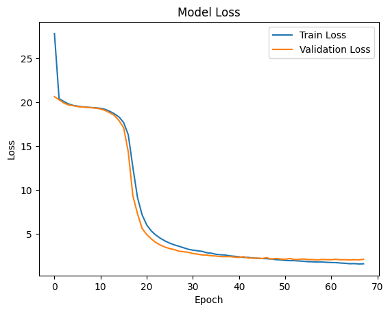

# Simple OCR Deep Learning example  
This repository contains a very simple example on OCR detection of license plate
codes using a Neural Network based on this example: 
- https://keras.io/examples/vision/captcha_ocr/#inference

The dataset used for this was this one:
- https://www.kaggle.com/datasets/nickyazdani/license-plate-text-recognition-dataset

## Dataset samples

## Model architecture
The base model architecture:

# Results
No image augmentations were used for the model that gave these results.

## Training metrics

## Predictions
Some predictions on the test set:

## Overall Performance:

- **Character Accuracy:** 92.47%
- **Average Precision:** 93.97%
- **Average Recall:** 92.47%
- **Average F1-Score:** 92.72%

## Classification Report:

| Character | Precision | Recall | F1-Score | Support |
|-----------|-----------|--------|----------|---------|
| 0         | 1.00      | 0.88   | 0.94     | 34      |
| 1         | 0.97      | 0.90   | 0.93     | 31      |
| 2         | 1.00      | 0.97   | 0.98     | 30      |
| 3         | 0.91      | 0.91   | 0.91     | 23      |
| 4         | 1.00      | 1.00   | 1.00     | 23      |
| 5         | 0.89      | 1.00   | 0.94     | 25      |
| 6         | 0.93      | 0.97   | 0.95     | 29      |
| 7         | 1.00      | 1.00   | 1.00     | 28      |
| 8         | 0.88      | 1.00   | 0.93     | 21      |
| 9         | 1.00      | 0.91   | 0.95     | 23      |
| A         | 0.50      | 1.00   | 0.67     | 1       |
| B         | 1.00      | 0.80   | 0.89     | 5       |
| C         | 1.00      | 0.50   | 0.67     | 6       |
| D         | 0.50      | 0.50   | 0.50     | 4       |
| E         | 1.00      | 1.00   | 1.00     | 4       |
| F         | 0.80      | 1.00   | 0.89     | 4       |
| G         | 1.00      | 1.00   | 1.00     | 2       |
| H         | 1.00      | 0.60   | 0.75     | 5       |
| J         | 1.00      | 0.75   | 0.86     | 4       |
| K         | 0.89      | 1.00   | 0.94     | 8       |
| L         | 0.75      | 1.00   | 0.86     | 3       |
| M         | 1.00      | 1.00   | 1.00     | 2       |
| N         | 1.00      | 1.00   | 1.00     | 8       |
| P         | 1.00      | 1.00   | 1.00     | 2       |
| Q         | 0.75      | 1.00   | 0.86     | 3       |
| R         | 0.80      | 0.80   | 0.80     | 5       |
| S         | 1.00      | 0.67   | 0.80     | 3       |
| T         | 0.86      | 1.00   | 0.92     | 6       |
| U         | 0.83      | 0.71   | 0.77     | 7       |
| V         | 0.83      | 0.83   | 0.83     | 6       |
| W         | 0.80      | 1.00   | 0.89     | 4       |
| X         | 0.80      | 1.00   | 0.89     | 4       |
| Y         | 0.80      | 1.00   | 0.89     | 4       |
| Z         | 1.00      | 0.80   | 0.89     | 5       |
| [         | 0.00      | 0.00   | 0.00     | 0       |

---
